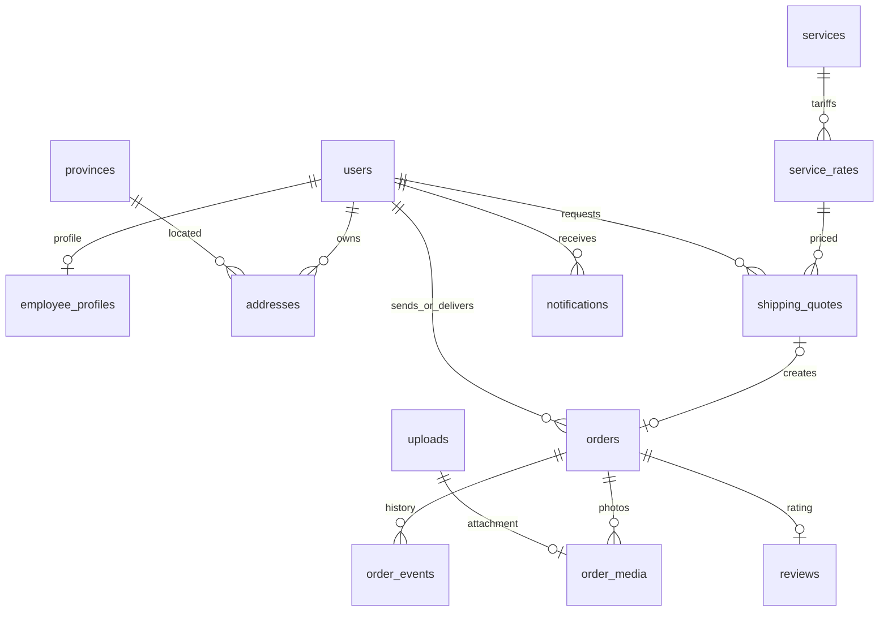

# MySQL và chuyển đổi từ mẫu SQLite

Hệ thống chỉ sử dụng **MySQL 8.0+**, InnoDB, utf8mb4. Không chạy SQLite trên backend hoặc app.

## Ánh xạ và bổ sung

| Mẫu SQLite | MySQL | Điều chỉnh |
|---|---|---|
| tai_khoan + thông tin chung khach_hang | users | Gộp tên/liên hệ/đăng nhập theo role; không lặp dữ liệu, mật khẩu bcrypt |
| nhan_vien | users + employee_profiles | Mã nhân viên, CCCD duy nhất nếu có, quê quán, ngày vào làm, trạng thái |
| dia_chi_nhan | addresses | Nhiều địa chỉ lấy hàng, tỉnh/ward/village/detail và tọa độ; một địa chỉ mặc định |
| goi_cuoc | services + service_rates | 2 dịch vụ × 3 tuyến, giá/khối lượng/5km/ETA/phụ phí |
| don_van_chuyen | orders | Báo giá, snapshot địa chỉ/giá/tuyến/đường đi, COD, tổng thanh toán |
| danh_gia | reviews | Một đánh giá mỗi đơn đã hoàn thành; khách và nhân viên gắn với đơn |
| Bổ sung | order_events | Lịch sử từng bước, lý do |
| Bổ sung | uploads + order_media | Ảnh hàng hóa/sự cố; ảnh sự cố liên kết sự kiện |
| Bổ sung | notifications | Cập nhật và lời mời đánh giá, thời điểm đã đọc |
| Bổ sung | shipping_quotes | Báo giá hết hạn sau 10 phút, cố định giá/địa chỉ |
| Bổ sung | provinces | 34 tỉnh và nhóm miền tính cước |
| Bổ sung | map_cache | Cache phản hồi máy chủ bản đồ, thời hạn |
| Bổ sung | schema_migrations | Phiên bản nâng cấp đã áp dụng |

File SQLite đính kèm chứa câu lệnh tạo bảng, không chứa bản ghi cần nhập. Đây là ánh xạ thiết kế; nếu có file dữ liệu SQLite thực tế thì cần bước import dữ liệu riêng.



## Nâng cấp không mất dữ liệu

```powershell
npm.cmd --prefix Backend run db:backup
npm.cmd run db:migrate
```

Backup JSON gồm DDL và các hàng, lưu ngoài Git trong `.local/backups`. Migrate dùng khóa MySQL `GET_LOCK`, tạo bảng còn thiếu, thêm trường/index/FK, chuyển trạng thái và ghi `002_self_service`. Không DROP bảng cũ, không xóa dữ liệu. DDL MySQL tự commit; nếu lỗi giữa chừng, sửa nguyên nhân và chạy lại. Migration kiểm tra cột/khóa đã có và có thể chạy lại.

`schema.sql` là baseline của phiên bản cũ; `workflow.sql` và `migrations/workflow.js` hoàn thiện cấu trúc mới. **Luôn chạy db:migrate**, không chỉ import riêng schema.sql. Cách tách này cho phép kiểm thử nâng cấp trực tiếp từ bảng cũ.

| Trạng thái cũ | Trạng thái mới |
|---|---|
| assigned | awaiting_pickup |
| in_transit, out_for_delivery | delivering |
| delivered | completed |
| failed | incomplete |
| pending, picked_up, cancelled | Giữ nguyên |

Đơn cũ có `distance_source=legacy`, không gán quãng đường giả. `total_amount` lấy số cước lịch sử; thiếu ảnh/đánh giá/tọa độ trên đơn cũ vẫn đọc được. Các cột cước trong `services` được giữ để tương thích dữ liệu lịch sử; **cước mới chỉ dùng service_rates**.

## Ràng buộc

- Mã đơn, email, mã nhân viên duy nhất; CCCD nếu nhập phải 12 chữ số và không trùng.
- `addresses.default_user_id` là generated column có UNIQUE để một khách chỉ có tối đa một địa chỉ mặc định. Transaction giữ ít nhất một mặc định nếu khách còn địa chỉ.
- Tiền VND DECIMAL(12,0); cân nặng DECIMAL(8,2); tọa độ DECIMAL(10,7).
- Báo giá lưu JSON snapshot gồm bảng cước, hai địa chỉ, extras, đường GeoJSON. Đơn sao chép snapshot, nên sửa/xóa sổ địa chỉ hoặc đổi giá không làm thay đổi đơn.
- Quote UNIQUE trên orders ngăn tạo trùng khi client gửi lại. Một ảnh chỉ gắn vào một đơn/sự cố. reviews.order_id UNIQUE.
- Ảnh lưu trong `.local/uploads`; MySQL lưu metadata/quyền/liên kết. Cần sao lưu cả ảnh và CSDL.
- SQL tham số hóa; việc nhận đơn/cập nhật/đánh giá dùng khóa dòng. Mọi timestamp nghiệp vụ lưu UTC, hiển thị giờ địa phương.
- Nhân viên có đơn chưa kết thúc không bị khóa hoặc ngừng việc; không có bảng tính lương.

## Công thức

```text
phí_km = ceil(max(0, distance_meters - 5000) × extra_km_fee / 1000)
bước_cân = ceil(max(0, weight - included_weight) / weight_step)
shipping_fee = base_fee + phí_km + bước_cân × extra_weight_fee
total_amount = shipping_fee + cod_fee + insurance_fee + packaging_fee
```

Phụ phí chỉ cộng khi khách chọn dịch vụ. `cod_amount` là tiền hàng thu hộ, không cộng vào total_amount. Mẫu 1,51kg, 6.321m, tiêu chuẩn và chọn bảo hiểm/đóng gói: 15.000 + 3.963 + 5.000 + 9.900 + 5.000 = **38.863đ**, chưa kể phí dịch vụ COD nếu Admin đặt khác 0.

Nội tỉnh = cùng mã tỉnh; nội miền = khác tỉnh cùng nhóm; liên miền = khác nhóm. Nhóm tính cước trong `config/provinces.js`: miền Bắc đến Ninh Bình, miền Trung Thanh Hóa đến Lâm Đồng, miền Nam các tỉnh còn lại. Đây là quy ước giá của ứng dụng.

Snapshot có `route_geometry`, `route_data_version` khi upstream cung cấp, và `route_fetched_at`. Bộ ranh giới tỉnh là tệp tham chiếu tĩnh có giấy phép, không phải một CSDL nghiệp vụ khác; toàn bộ tài khoản/đơn/giá/thông báo vẫn trong MySQL.
