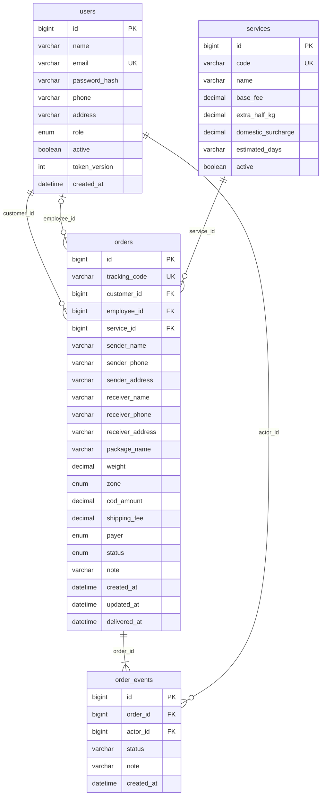

# MySQL và mô hình dữ liệu

Schema: `Backend/src/scripts/schema.sql`. Engine InnoDB, mã hóa `utf8mb4`, hỗ trợ tiếng Việt. Bốn bảng nghiệp vụ:



## Thiết kế dữ liệu

- `users.role`: `admin`, `employee`, `customer`. Không có bảng hoặc trường tính lương.
- `password_hash` lưu bcrypt; không trả về client. `token_version` dùng để thu hồi phiên đăng nhập.
- Người gửi/nhận trên đơn là bản chụp tại lúc tạo; sửa hồ sơ khách hàng không thay đổi địa chỉ trên đơn cũ.
- `employee_id` có thể NULL trước khi phân công. API kiểm tra vai trò và trạng thái tài khoản khi phân công.
- `shipping_fee` lưu cước tại thời điểm tạo. Đổi bảng `services` không tính lại đơn đã có.
- Tiền VND dùng `DECIMAL(12,0)`; khối lượng dùng `DECIMAL(8,2)`.
- `order_events` ghi mỗi bước thay đổi và mỗi lần phân công lại. Các bản ghi không bị xóa từ giao diện.
- Các trường thời gian dùng UTC; biểu đồ Admin gộp ngày theo UTC+7. Client hiển thị giờ địa phương.
- Có khóa ngoại và index theo khách hàng, nhân viên, trạng thái, thời điểm tạo; các câu truy vấn dữ liệu người dùng dùng tham số SQL.

## Công thức cước cấu hình

```text
Cước = base_fee
     + max(0, ceil((weight - 1) × 2)) × extra_half_kg
     + (zone == 'domestic' ? domestic_surcharge : 0)
```

Giá minh họa: tiêu chuẩn 25.000 đ cho 1 kg đầu, 5.000 đ cho mỗi 0,5 kg tiếp theo, 15.000 đ phụ phí liên tỉnh. Ví dụ 1,51 kg liên tỉnh: `25.000 + 2 × 5.000 + 15.000 = 50.000 đ`. Admin có thể sửa giá trong web.

COD được lưu riêng. Số tiền nhân viên cần thu từ người nhận là `cod_amount + shipping_fee` nếu `payer=receiver`, hoặc chỉ `cod_amount` nếu `payer=sender`. Trạng thái giao thành công chưa phải xác nhận đối soát COD.

## Khởi tạo và dữ liệu mẫu

`npm run db:migrate` tạo CSDL nếu chưa có, tạo bảng còn thiếu và hai dịch vụ mặc định bằng `INSERT IGNORE`. Script không xóa bảng/dữ liệu có sẵn. `npm run db:seed` tạo Admin và tùy chọn dữ liệu minh họa; chạy lại không đổi mật khẩu hoặc ghi đè đơn cũ.

MySQL riêng dùng cho Windows được quản lí bằng `scripts/start-local-mysql.ps1` và `npm run db:local:stop`. CSDL kiểm thử có tiền tố riêng, không dùng schema ứng dụng.
